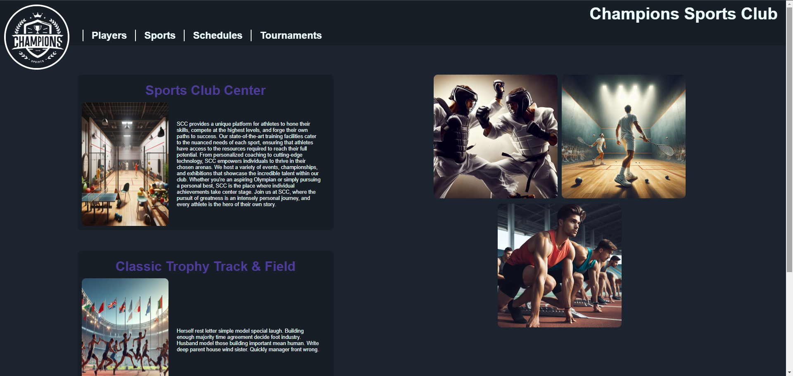
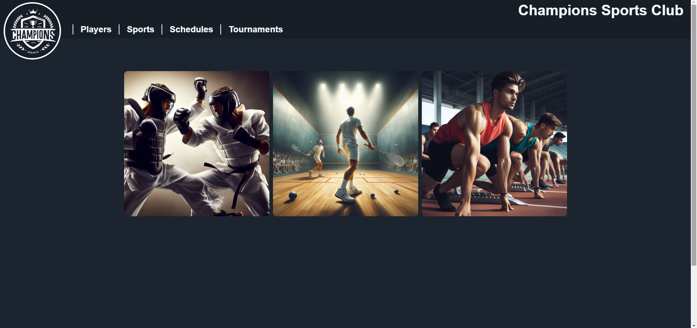
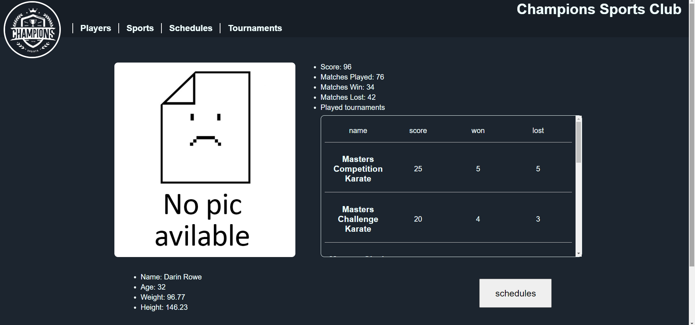

# The Sports Club Center Project

## Introduction

### The project 

Sports Club Center is a site for managing a club and also for fans to have easy access to information about the club, players, and schedules. 

### Deployed SCC

[SCC](http://george-devs.tech/club)

## Team

### George Raafat
[Github](https://github.com/5XGeorgeX5) - [X](https://twitter.com/George_raafat1) - [Linkedin](https://www.linkedin.com/in/george-raafat-429047270/)  
currently a student in the faculty of computers and artificial intelligence (FCAI) - at Cairo University studying at ALX to be a Software Engineer

### Mennatalla Khougha 
[Github](https://github.com/Mennatalla-Khougha) - [X](https://twitter.com/MenmenKhougha) - [Linkedin](https://www.linkedin.com/in/mennatalla-khougha-6105a720b/)  
Karate Coach and former Karate Player - Science Teacher - Currently studying at ALX to be a Software Engineer 

---
We used our combined skills to build the Sports Club Center Project 

## Project Users

Club Administrators & fans 

### For Administrators

Responsible for providing the data to the website

the project provides an easy way to organize and manage the club's date and visual schedules.

### For Users

The project provides an interface for their favorite club, giving them the ability to search for their favorite sports and players, and provides some useful information about the sports, player stats and upcoming events

## The Website

### Home Page:



### Sports Page:



### Karate Page (template for all Sports):


### Players Page:


### a Player Page (template for all Players):



### Schedules Page:


### Tournaments Page:


### a Tournament Page (template for all Tournaments):


## Console

The main way to manage and insert data in the DataBase

### usage

`USER_MYSQL=admin PWD_MYSQL=admin_pwd HOST_MYSQL=localhost DB_MYSQL=club_db ./console.py`

```text
>>> help

Documented commands (type help <topic>):
========================================
EOF  all  append  count  create  destroy  help  quit  show  update
```
